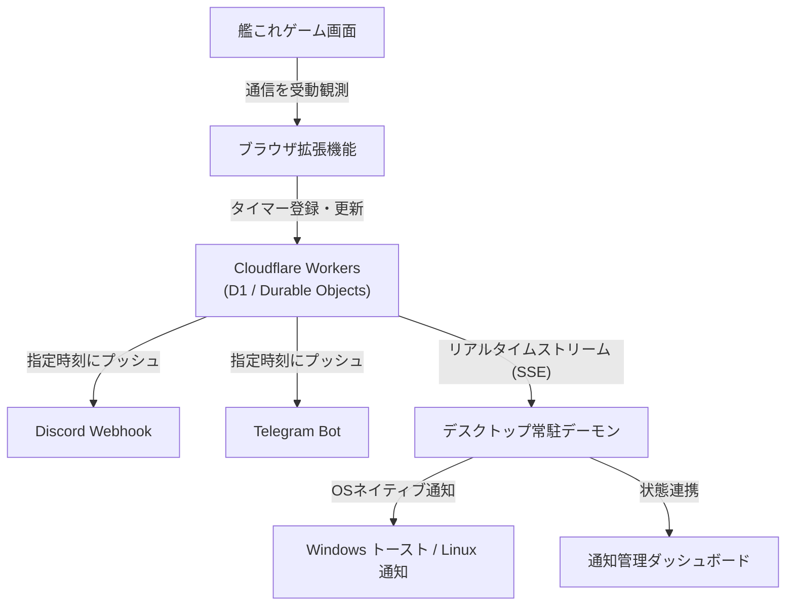

## ツールの概要

**kancolle-notify** は、ブラウザでプレイ中の「艦隊これくしょん -艦これ-」の通信を受動的に読み取り、遠征帰投・入渠修復・泊地修理・疲労回復などのタイマーを高精度に通知するシステムです。

中央サーバーに **Cloudflare Workers** を採用しており、**PCをシャットダウンしたりブラウザを閉じても、指定時刻にスマホの Discord や Telegram へ確実にプッシュ通知** をお届けします。
PC稼働中は、超軽量な常駐デーモンによる OS ネイティブ通知（Windows トースト通知 / Linux D-Bus 通知）や、専用の **通知管理ダッシュボード** で手元でもリアルタイムに残り時間を確認できます。

## 主な特徴と安全設計

- 🛡️ **ゼロ・トラフィック原則（BANリスクの極限低減）**
  - 艦これ運営サーバーへの自発的なAPIリクエストや独自通信は一切行いません。ブラウザが通常受信しているゲームパケットを受動的に読み取るだけのため安全です。
- ☁️ **Cloudflare Workers 連携（24時間完全自動）**
  - 個人利用の無料枠（Freeプラン）で十分に運用可能。PCを閉じている間もクラウドがスケジュールを管理し、指定時刻に外部サービスへ通知します。
- 🖥️ **デスクトップ常駐通知＆管理ダッシュボード**
  - **常駐デーモン**: サーバーからのプッシュ通知を受信し、Windows トースト通知や Linux D-Bus 通知を発行。定期的な重いポーリングを行わない超軽量・省電力設計です。
  - **通知管理ダッシュボード**: 全艦隊の遠征状況や入渠ドック、泊地修理、疲労度回復の残り時間を秒単位でリアルタイム表示します。
- 📱 **選べる通知先**
  - デスクトップ通知（Windows / Linux）、Discord Webhook、Telegram Bot に対応しています。

## 対応している監視タイマー

| タイマー種別 | 監視・通知内容 |
| :--- | :--- |
| **遠征帰投** | 第2〜第4艦隊の遠征完了時刻を高精度に算出・通知 |
| **入渠修復** | 各ドックの入渠完了予定時刻を管理・通知 |
| **泊地修理** | 明石による泊地修理の 20分サイクル確定判定を自動追従 |
| **疲労度回復** | 3分周期の自然回復（cond 49上限）および母港給糧艦（cond 54上限）を高精度シミュレーション |
| **工廠建造** | 建造ドックの完成時刻を通知（艦名の非表示マスキング設定にも対応） |

## システムの仕組み

ブラウザ拡張機能がゲーム通信を受動観測し、Cloudflare Workers とデスクトップ常駐アプリが連携して通知を届けます。



## 導入手順

本ツールのインストーラーは、Cloudflare Workers の自動構築から資材の配置まで全自動で行います。

### 1. インストーラーの実行

#### Windows の場合
1. ダウンロードボタンから `kancolle-notify-setup.exe` を取得して実行します。
2. 画面のウィザードに従い、Cloudflare API トークン（Workers / D1 の編集権限）と通知先（Discord Webhook 等）を入力します。
3. 自動で資材取得と Cloudflare 側の環境構築が行われます。

#### Linux の場合

**前提環境（必要なツール）**:
- `curl`, `tar` が必要です（未導入の場合は `sudo apt install curl tar` 等で事前にインストールしてください）。

**ダウンロードした `install.sh` を実行する手順**:
1. ターミナルを開き、ダウンロード先フォルダー（例: `~/Downloads`）に移動します。
2. 実行権限を付与して実行します：

```bash
chmod +x install.sh
./install.sh
```
（または `bash install.sh` でも直接実行できます）

3. 対話プロンプトに従い、Cloudflare API トークンと通知先を入力します。

💡 **ブラウザでダウンロードせず直接導入する場合**:  
以下のワンライナーをターミナルで実行するだけでもセットアップ可能です：

```bash
curl -fsSL https://raw.githubusercontent.com/Ikumyon/kancolle-notify/main/installer/install.sh | bash
```

📁 **インストール先について**:  
デフォルトでは、インストーラーを実行した場所に `kancolle-notify` フォルダが作成され、その中に `desktop`（常駐デーモン・ダッシュボード）と `extension`（ブラウザ拡張機能）が展開されます。

### 2. ブラウザ拡張機能の読み込み

1. Google Chrome、Microsoft Edge、または Damecon を開きます。
2. 拡張機能管理画面を開きます（Chrome: `chrome://extensions` / Edge: `edge://extensions`）。
3. 画面右上の **「デベロッパーモード」** を ON にします。
4. **「パッケージ化されていない拡張機能を読み込む」** をクリックし、生成された `kancolle-notify/extension` フォルダを選択します。

※接続先サーバー情報や認証設定はインストーラーによって自動設定されています。

### 3. 利用開始

- ゲーム画面を開き、開発者ツール（F12）を開いた状態でプレイを開始すると、自動的にタイマーが観測・登録されます。
- デスクトップのショートカットまたはスタートメニューから **「艦これ 通知管理」** を開くと、現在の運行状況や残り時間をダッシュボードで確認できます。

## ほかのツールとの連携

- **[Kancolle Stream Overlay](../../tool.html?tool=kancolle-stream-overlay)**:
  本ツールで管理している遠征や入渠などのタイマー情報を、配信画面やゲーム画面上にオーバーレイパネルとして重ねて表示できます。

## 注意事項

- 本ツールは非公式のファンメイドツールであり、DMM GAMES様および「艦これ」運営鎮守府様とは一切関係ありません。
- 動作には無料の Cloudflare アカウントおよび API トークンが必要です。
