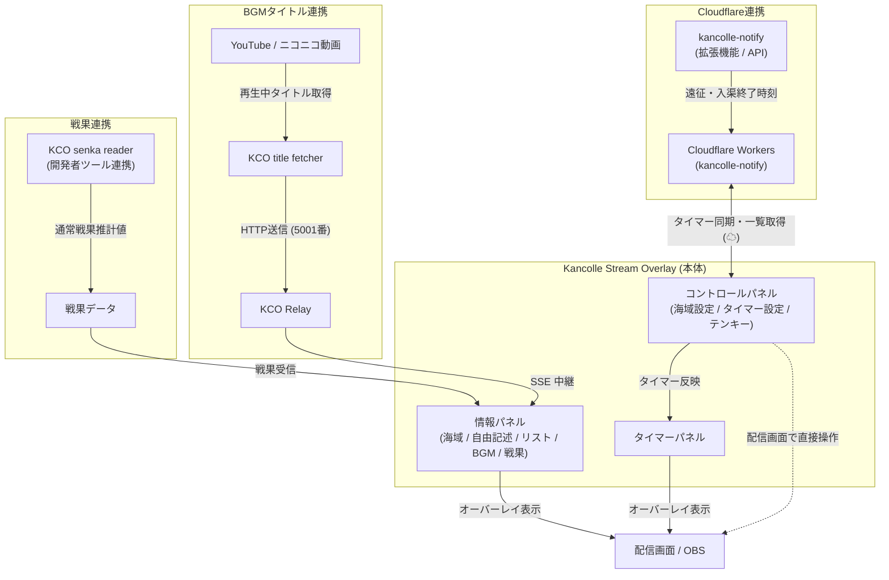

## どんなツールか

**Kancolle Stream Overlay** は、艦これ配信の画面上にタイマー、出撃海域、周回カウンター、再生中BGM、戦果などを重ねて配置できる多機能ブラウザ拡張機能（Manifest V3）です。

画面レイアウトや配信スタイルに合わせて、各パネルの位置・サイズ・デザイン（すりガラス効果や透過度など）を自由自在にカスタマイズできます。

---

## 3つの独立パネル

画面上に配置できる3つの独立したパネルが用意されています。ドラッグ＆ドロップで任意の位置へ移動でき、右下のハンドルでサイズ変更が可能です。

### 1. タイマーパネル (`TIMER`)

疲労回復時間や遠征・入渠の残り時間をリアルタイムにカウントダウン表示します。

- **疲労回復の自動計算**: 現在値と目標値（例: 20 → 49）を入力するだけで、必要な回復時間を自動算出します。
- **母港給糧艦（給）対応**: 給糧艦による疲労回復（49を超える回復、最大54まで）の計算間隔と上昇値に対応しています。
- **プリセットボタン**: よく使う時間（例: 10分、20分、30分など）を最大4件まで登録し、ワンクリックでタイマーを開始できます。
- **スタック表示**: カウントダウン（残り時間 `mm:ss`）と終了予定時刻（`hh:mm`）を分かりやすく重ねて表示します。
- **表示モードの切り替え**: 「常時表示」または「タイマー動作中のみ自動表示」を選択できます。
- **背景のクリック透過**: タイマーの背景部分をクリック透過させ、タイマーを表示したまま背面のゲーム画面を直接操作できます。
- **完了時のデスクトップ通知**: 設定時間が経過した際にブラウザ通知でお知らせします。
- **Cloudflare (kancolle-notify) 連携**: クラウド上で稼働している遠征・入渠・疲労度・手動タイマーを一覧取得し、タイマーパネルへ引き継いで表示できます。

### 2. 情報パネル (`INFORMATION`)

配信画面上に必要な情報を整理して表示できるマルチカラムパネルです。境界線をドラッグして列幅を自由に調整できます（比率スナップ機能付き）。ヘッダーやパネル背景枠の表示・非表示も切り替え可能です。

用途に合わせて以下の **5種類のカード** を自由に組み合わせて配置できます。

| カード種類 | 内容と特徴 |
| :--- | :--- |
| **海域 (`map`)** | 出撃海域（通常: `7-4` / イベント: `E-2` 等）、難易度（甲・乙・丙・丁）、進行状態（ギミック・削り・ラスダン・掘り）を視認性の高いカラーバッジで表示します。 |
| **自由記述 (`text`)** | 任意のメモや告知文（例: 「ラスダン沼り中」「S勝利狙い」など）を表示します。枠に収まらない長文は「環状シフト」または「無限スクロール」でスムーズに流せます。 |
| **リスト / カウンター (`list`)** | ドロップ集計や周回カウントを管理します。タグをクリックするだけでカウントアップ・カウントダウンが可能な対話型カウンターに対応しています。 |
| **BGM表示 (`BGMtitle`)** | 配信中に再生している楽曲タイトル（YouTube / ニコニコ動画）をリアルタイムでスクロール表示します（KCO Relay連携）。 |
| **戦果表示 (`senka`)** | 観測開始後の通常戦果推計値を表示します（KCO 通常戦果リーダー連携、JST 2:00 / 14:00 リセット）。※本体にはゲーム通信を監視する処理を含まない安全設計です。 |

### 3. コントロールパネル (`CONTROL`)

配信画面上で直接、海域バッジの切り替えやタイマー操作を素早く行えるコントローラーです。配信中に不要な場合は非表示に設定できます。

- **海域・難易度・状態のワンタッチ操作**: イベント限定フラグ(E)の切り替え、海域番号入力、難易度ボタン（甲/乙/丙/丁/なし）、状態ボタン（ギ/削/ラ/掘/なし）をワンクリックで変更可能。
- **タイマー設定とクラウド連携**: 分数の直接入力、プリセットボタン、疲労度入力、停止ボタンに加え、「`☁`」ボタンからクラウド稼働中タイマーを取得可能。
- **ポップアップ式テンキー (Numpad)**: 数値入力欄をクリックすると専用テンキーが画面上にポップアップ表示され、マウス操作のみで素早く入力できます。キーボードのTabキーによる入力遷移や自動フォーカス移動にも対応しています。

---

## リストカードのカウンター記法ガイド

情報パネルの「リストカード」では、カンマ区切りで項目を並べるだけでなく、特殊な記法を使うことで **画面上のクリックで数値が増減するインタラクティブなカウンター** を作成できます。

```text
山汐丸:+0/5, まるゆ:+2, バケツ:-10/0, 攻略完了
```

| 記法 | 動作 | 表示例・用途 |
| :--- | :--- | :--- |
| `項目:+初期値/上限` | クリックで **+1**（上限まで） | `山汐丸:+0/5` → ドロップ掘りの目標達成チェックに便利 |
| `項目:+初期値` | クリックで **+1**（上限なし） | `S勝利:+0` → 周回数やS勝利数のカウントに便利 |
| `項目:-初期値/下限` | クリックで **-1**（下限まで） | `バケツ:-20/0` → 消費資材や残機などの減算管理に便利 |
| `項目:数値` | 数値のみ表示（固定） | `目標:100` → 固定値のメモに便利 |
| `項目` | クリックで **項目を削除** | `補給艦任務` → 完了したタスクを画面から消すチェックリストに便利 |

> [!TIP]
> リストカード内のタグは、マウスホイールやドラッグ操作での横スクロールにも対応しています。

---

## デザイン・外観のカスタマイズ

ポップアップ設定画面の「デザイン」タブでは、リアルタイムプレビューを確認しながら全体の見た目を細かく調整できます。

- **パネル拡大率**: `0.1倍` 〜 `2.0倍` の範囲で全体のスケールを変更可能
- **基本文字サイズ**: `20px` 〜 `60px`
- **背景色と不透明度**: カラーピッカーによる自由な色指定と、`0%`（完全透明）〜 `100%`（不透明）のスライダー調整
- **すりガラス調エフェクト（背景ぼかし）**: `0px` 〜 `20px` のぼかし（Backdrop Blur）により、ゲーム画面と馴染む美しい半透明フロストガラス質感を演出
- **影の広がり**: `0px` 〜 `100px` のドロップシャドウで視認性を確保
- **スクロール速度**: 溢れた文字が流れる速度を調整可能
- **全パネルの中央復帰**: 誤って画面外へ移動させて見失ってしまったパネルを、ワンクリックで画面中央へ一括配置復旧

---

## ほかのツールとの連携

本拡張機能は単体でもすべての表示・操作機能が動作しますが、関連ツールと連携することでより高度な自動化が可能です。

- **[kancolle-notify](../../tool.html?tool=kancolle-notify)**:
  - タイマー開始時に Cloudflare Workers へ終了時刻を送信。
  - コントロールパネルの「`☁`」ボタンから、クラウド上で稼働中の遠征・入渠・疲労度・手動タイマーを一覧取得し、タイマーパネルへ引き継ぎ表示できます。
- **[KCO title fetcher](../../tool.html?tool=kco-title-fetcher)** ＆ **[KCO Relay](../../tool.html?tool=kco-relay)**:
  - YouTube やニコニコ動画で再生中のBGMタイトルを自動取得し、KCO Relay を経由して SSE（Server-Sent Events）でオーバーレイの BGM カードへリアルタイム反映します。
- **[KCO senka reader](../../tool.html?tool=kco-senka-reader)**:
  - ゲーム内の戦果推計データを受信し、戦果カードへリアルタイム表示します。本オーバーレイ本体には通信解析コードを持たないため安全に運用できます。

### 連携構成図



---

## 導入手順

1. **拡張機能のダウンロード**:
   - 右上の「ダウンロード」ボタンより最新のZIPファイルをダウンロードし、任意の場所に解凍します。
2. **ブラウザへの読み込み**:
   - Chrome または Edge を開き、拡張機能管理ページ（`chrome://extensions` または `edge://extensions`）にアクセスします。
   - 画面右上の **「デベロッパーモード」** をONにします。
   - **「パッケージ化されていない拡張機能を読み込む」** をクリックし、解凍したフォルダ（`manifest.json` があるフォルダ）を選択します。
3. **初期設定**:
   - ツールバーの拡張機能アイコンをクリックして設定画面を開きます。
   - **タイマー**: プリセット分数や通知の有無を設定します。
   - **情報**: レイアウトパレットから使いたいカードを配置し、幅や内容を設定します。
   - **デザイン**: 配信画面の背景に合わせて拡大率やすりガラス効果、透明度を好みに調整します。
4. **ゲーム画面での利用**:
   - 艦これのプレイ画面を開くとオーバーレイパネルが表示されます。見やすい位置へドラッグして配置してください。
